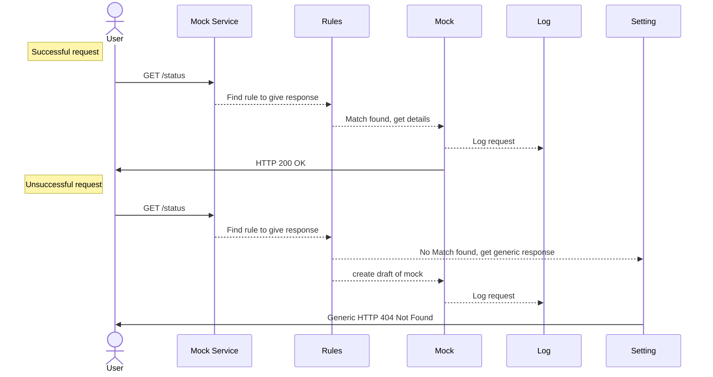
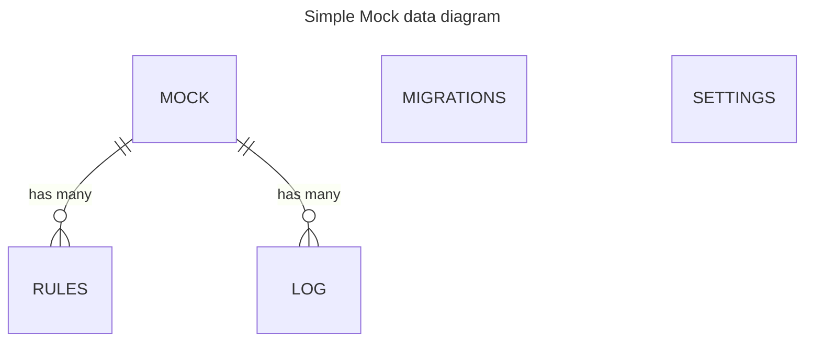

# Design ideas

## Sequence diagrams

## Data diagrams

## unsorted ideas

- [ ] On request get all rules for method, path, headers, body
- [ ] add cache for rules, update on rules update
- [ ] setup default data in migrations
- [x] create init migration using `aerich init -t dmock.settings.DB_CONFIG --location dmock/models/migrations -s .`
- [ ] add swagger url to documentation
- [x] reconsider if we need migrations
- [ ] find ALL matching rules and get mock with the highest priority (id == priority)
- [ ] there should be identification, how many rules matched
- [ ] create in-memory key-value storage for actions