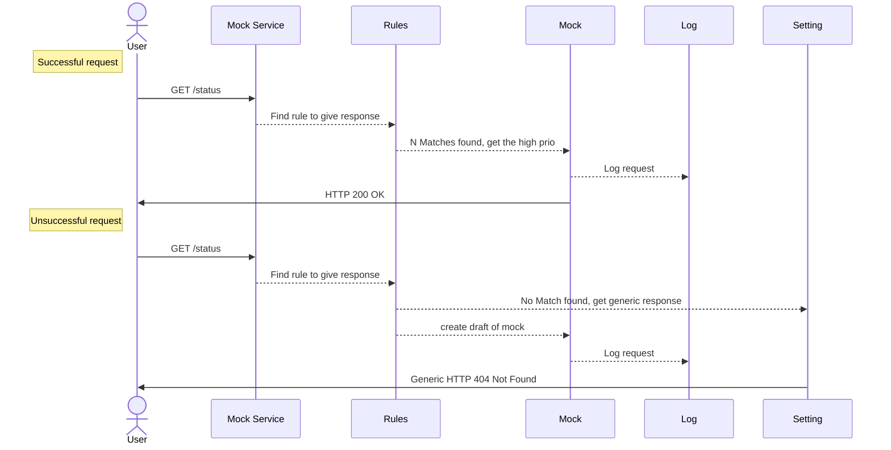
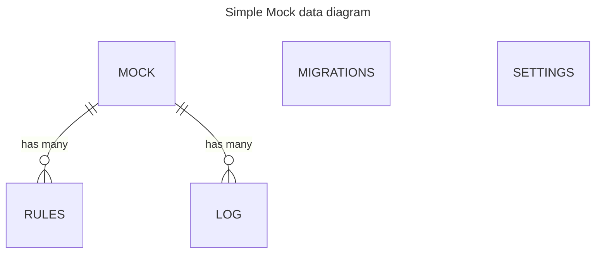

# Design ideas

## Sequence diagrams



## Data diagrams



## unsorted ideas

- [ ] On request get all rules for method, path, headers, body. all rules od the mock should match
- [ ] add cache for rules, update on rules update
- [ ] setup default data in migrations
- [x] create init migration using `aerich init -t dmock.settings.DB_CONFIG --location dmock/models/migrations -s .`
- [ ] add swagger url to documentation
- [x] reconsider if we need migrations
- [ ] find ALL matching rules and get mock with the highest priority (id == priority)
- [ ] there should be identification, how many rules matched
- [ ] create in-memory key-value storage for actions
- [ ] logs should be deleted in 1-2 days

## API payloads
### mock with rule
```json
{
  "id": 1,
  "name": "mock max",
  "status": "active",
  "labels": ["test", "demo"],
  "delay": 0,
  "isDefault": false,
  "request": {
    "method": "GET",
    "url": "/status"
  },
  "response": {
    "status": 200,
    "headers": {
      "Content-Type": "application/json"
    },
    "body": "{\"status\": \"ok\"}"
  },
  "isAction": false,
  "action": "print('hello world')",
  "createdAt": "2021-09-01T00:00:00Z",
  "requestCount": 0,
  "activeRulesCount": 0,
  "logs": [],
  "rules": [
    {
      "id": 1,
      "isActive": true,
      "type": "1-method",
      "operation": "equals",
      "key": "GET"
    }
  ]
}
```